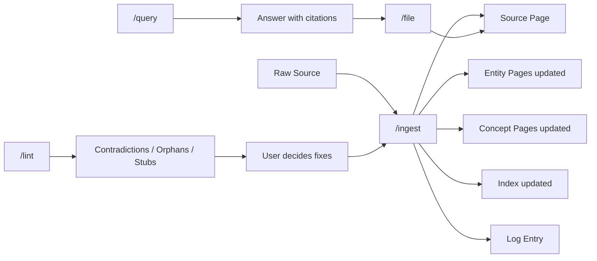

# WORKFLOW.md — Operations & Kadenz

## Empfohlene Kadenz

| Kadenz | Operation | Dauer | Trigger |
|---|---|---|---|
| Pro Source | `/clip` → `/ingest` | 5–15 min | Neues interessantes Material |
| Ad-hoc | `/query <question>` | 1–5 min | Frage taucht auf |
| Ad-hoc | `/file <slug>` | < 1 min | Query-Antwort ist wertvoll |
| Wöchentlich | `/lint` | 10–20 min | z.B. jeden Sonntag |
| Monatlich | `/reindex` | 2 min | Nach großen Ingest-Batches |

## Der Compounding-Loop



## Ingest-Flow im Detail

```
User: /clip https://...
  → Agent fetcht URL → speichert in raw/articles/<slug>.md

User: /ingest raw/articles/<slug>.md
  → Agent stellt 2–3 Rückfragen
  → User gibt Fokus vor
  → Agent schreibt Source-Page
  → Agent updated Entity- und Concept-Pages
  → Agent updated Index
  → Agent appendet Log-Entry
  → Agent reportet Diff an User
```

## Query-Flow

```
User: /query "Was sagt das Wiki über X?"
  → Agent liest index.md
  → Agent identifiziert relevante Pages
  → Agent liest diese Pages vollständig
  → Agent synthetisiert Antwort mit [[citations]]
  → Agent bietet /file an

User (optional): /file x-overview
  → Agent speichert Antwort als wiki/overviews/x-overview.md
  → Index + Log Update
```

## Lint-Zyklus

```
User: /lint
  → Agent scannt wiki/ vollständig
  → Agent erzeugt wiki/lint-reports/YYYY-MM-DD.md
  → Agent reportet: Contradictions / Orphans / Stubs / Missing Concepts / Stale Claims / Broken Links / Index-Drift
  → User entscheidet pro Item
  → User triggert nötige Ingest/Edit-Aktionen
```

## Human-in-the-Loop Prinzip

Der User:
- Kuratiert welche Sources in `raw/` landen
- Gibt Fokus und Priorisierung bei Ingest vor
- Entscheidet ob Query-Antworten gefilt werden
- Reviewed Lint-Reports und entscheidet über Fixes
- Kann jederzeit korrigierend in Wiki-Pages eingreifen (mit Log-Entry)

Der Agent:
- Schreibt das Wiki
- Pflegt Index und Log
- Erkennt Widersprüche und Lücken
- Schreibt nie in `raw/`
