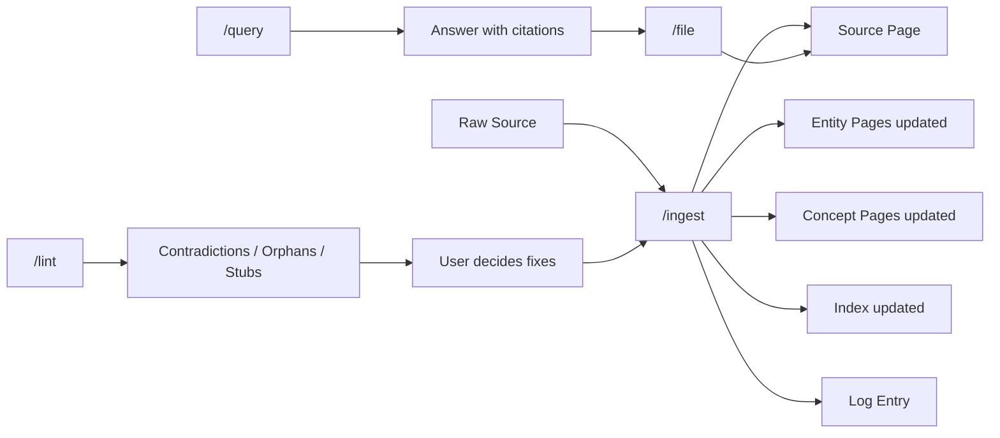

# WORKFLOW.md — Operations & Cadence

> Full reference: [README.md](./README.md) | Setup: [SETUP.md](./SETUP.md) | Scale limits: [TRADE-OFFS.md](./TRADE-OFFS.md)

## Recommended cadence

| Cadence | Operation | Duration | Trigger |
|---|---|---|---|
| Per source | `/clip` → `/ingest` | 5–15 min | New interesting material |
| Ad-hoc | `/query <question>` | 1–5 min | A question comes up |
| Ad-hoc | `/search <term>` | < 1 min | Quick full-text lookup |
| Ad-hoc | `/file <slug>` | < 1 min | Query answer is worth keeping |
| Weekly | `/lint` | 10–20 min | e.g. every Sunday |
| Monthly | `/reindex` | 2 min | After large ingest batches |

## The compounding loop



## Ingest flow in detail

```
User: /clip https://...
  → Agent fetches URL → saves to raw/articles/<slug>.md

User: /ingest raw/articles/<slug>.md
  → Agent asks 2–3 clarifying questions
  → User sets focus
  → Agent writes Source page
  → Agent updates Entity and Concept pages
  → Agent updates index
  → Agent appends log entry
  → Agent reports diff to user
```

## Query flow

```
User: /query "What does the wiki say about X?"
  → Agent reads index.md
  → Agent identifies relevant pages
  → Agent reads those pages in full
  → Agent synthesizes answer with [[citations]]
  → Agent offers /file

User (optional): /file x-overview
  → Agent saves answer as wiki/overviews/x-overview.md
  → Index + log update
```

## Lint cycle

```
User: /lint
  → Agent scans all of wiki/
  → Agent creates wiki/lint-reports/YYYY-MM-DD.md
  → Agent reports: Contradictions / Orphans / Stubs / Missing Concepts / Stale Claims / Broken Links / Index Drift
  → User decides per item
  → User triggers necessary ingest/edit actions
```

## Human-in-the-loop principle

**The user (Architect):**
- Curates which sources land in `raw/`
- Sets focus and priorities during ingest
- Decides whether query answers get filed
- Reviews lint reports and decides on fixes
- Can intervene and correct wiki pages at any time (with log entry)

**The agent (Programmer):**
- Writes the wiki
- Maintains index and log
- Detects contradictions and gaps
- **Never** writes to `raw/`
- **Never** auto-fixes lint issues

## Compounding effect

The system accumulates value over time. After 50 ingests, Entity and Concept pages are already so densely linked that new sources primarily extend existing pages rather than creating new ones. The marginal effort per source decreases — the quality of answers increases.

This effect **does not occur** with:
- Inconsistent cadence (long gaps → index drift)
- Missing Git commits (agent drift goes unnoticed)
- Skipped lint cycles (contradictions accumulate)

---

---

# WORKFLOW.md — Operations & Kadenz *(Deutsch)*

> Vollständige Referenz: [README.md](./README.md) | Setup: [SETUP.md](./SETUP.md) | Scale-Limits: [TRADE-OFFS.md](./TRADE-OFFS.md)

## Empfohlene Kadenz

| Kadenz | Operation | Dauer | Trigger |
|---|---|---|---|
| Pro Source | `/clip` → `/ingest` | 5–15 min | Neues interessantes Material |
| Ad-hoc | `/query <question>` | 1–5 min | Frage taucht auf |
| Ad-hoc | `/search <term>` | < 1 min | Schnelle Volltextsuche |
| Ad-hoc | `/file <slug>` | < 1 min | Query-Antwort ist wertvoll |
| Wöchentlich | `/lint` | 10–20 min | z.B. jeden Sonntag |
| Monatlich | `/reindex` | 2 min | Nach großen Ingest-Batches |

## Der Compounding-Loop


## Ingest-Flow im Detail

```
User: /clip https://...
  → Agent fetcht URL → speichert in raw/articles/<slug>.md

User: /ingest raw/articles/<slug>.md
  → Agent stellt 2–3 Rückfragen
  → User gibt Fokus vor
  → Agent schreibt Source-Page
  → Agent updated Entity- und Concept-Pages
  → Agent updated Index
  → Agent appendet Log-Entry
  → Agent reportet Diff an User
```

## Query-Flow

```
User: /query "Was sagt das Wiki über X?"
  → Agent liest index.md
  → Agent identifiziert relevante Pages
  → Agent liest diese Pages vollständig
  → Agent synthetisiert Antwort mit [[citations]]
  → Agent bietet /file an

User (optional): /file x-overview
  → Agent speichert Antwort als wiki/overviews/x-overview.md
  → Index + Log Update
```

## Lint-Zyklus

```
User: /lint
  → Agent scannt wiki/ vollständig
  → Agent erzeugt wiki/lint-reports/YYYY-MM-DD.md
  → Agent reportet: Contradictions / Orphans / Stubs / Missing Concepts / Stale Claims / Broken Links / Index-Drift
  → User entscheidet pro Item
  → User triggert nötige Ingest/Edit-Aktionen
```

## Human-in-the-Loop Prinzip

**Der User (Architekt):**
- Kuratiert welche Sources in `raw/` landen
- Gibt Fokus und Priorisierung bei Ingest vor
- Entscheidet ob Query-Antworten gefilt werden
- Reviewed Lint-Reports und entscheidet über Fixes
- Kann jederzeit korrigierend in Wiki-Pages eingreifen (mit Log-Entry)

**Der Agent (Programmer):**
- Schreibt das Wiki
- Pflegt Index und Log
- Erkennt Widersprüche und Lücken
- Schreibt **nie** in `raw/`
- Fixt **nie** automatisch Lint-Issues

## Compounding-Effekt

Das System akkumuliert Wert über Zeit. Nach 50 Ingests sind Entity- und Concept-Pages bereits so dicht verlinkt, dass neue Sources primär bestehende Pages erweitern statt neue anzulegen. Der Marginalaufwand pro Source sinkt — die Qualität der Antworten steigt.

Dieser Effekt tritt **nicht ein** bei:
- Inkonsistenter Kadenz (lange Pausen → Index-Drift)
- Fehlenden Git-Commits (Agent-Drift unbemerkt)
- Übersprungenen Lint-Zyklen (Widersprüche akkumulieren)
